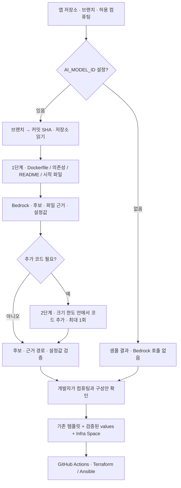

# AI 추천 · 저장소에서 배포 구성안까지

[← 프로젝트 소개](../profile/README.md)

PieckPick은 공개 GitHub 저장소를 읽고 Amazon Bedrock Converse API로 실행 환경과 배포 설정값을 추천합니다. 인프라 담당자가 준비한 Infra Space의 컴퓨팅 목록을 제약으로 사용하고, 파일 근거·추천 이유·단점을 개발자에게 보여줍니다.

## 분석의 입력과 결과

저장소 브랜치를 커밋 SHA로 확정하고 그 커밋의 파일을 읽습니다. 처음에는 루트의 Dockerfile·의존성 파일·README·시작 스크립트를 전달합니다. 모델이 추가 코드가 필요하다고 판단하면 크기 한도 안에서 두 번째 분석을 한 번 수행합니다. 파일 하나는 최대 20,000자, 2단계 입력은 최대 100,000자로 제한하며 모든 코드를 빠짐없이 분석한다고 보장하지 않습니다. [저장소 읽기와 파일 선택](https://github.com/softbank-hackathon-2026/Freesia-backend/blob/880e7da78f2fcb9100f3bfc354eceaa990c476b1/app/ai/repo.py), [분석 실행](https://github.com/softbank-hackathon-2026/Freesia-backend/blob/880e7da78f2fcb9100f3bfc354eceaa990c476b1/app/ai/analyze.py#L122).

| 결과 | 의미 |
|---|---|
| 실행 요구사항 | 런타임·포트·시작 방법 등 파일에서 파악한 조건 |
| 파일 근거 | 파일 경로와 관찰 내용, 확인·추정을 구분하는 `certain` 값 |
| 컴퓨팅 후보 | 추천 `selected` 1개, 대안 `alternative`, 비추천 `unsuitable`과 각각의 이유·단점 |
| `template_values` | 선택 가능한 컴퓨팅별 템플릿 설정값 |

추천 후보는 해당 Infra Space가 허용한 컴퓨팅 목록과 일치해야 하고, 근거 파일은 실제로 전달한 경로여야 합니다. 저장소 내용은 분석 자료로 취급하도록 프롬프트에 명시합니다. 현재 모델 입력에 전달되는 인프라 제약은 컴퓨팅 목록이며, 전체 VPC·라우팅·실시간 자원 상태를 분석하는 흐름은 구현 범위에 포함되지 않습니다. [응답 스키마·검증·프롬프트](https://github.com/softbank-hackathon-2026/Freesia-backend/blob/880e7da78f2fcb9100f3bfc354eceaa990c476b1/app/ai/analyze.py).

## 코드 생성보다 템플릿 설정에 집중

| 컴퓨팅 | 추천 설정의 예 |
|---|---|
| ECS Fargate | 컨테이너 포트, health 경로, CPU·메모리 |
| Lambda | 컨테이너 포트, health 경로, 메모리·timeout |
| EC2 | 컨테이너 포트, health 경로, 인스턴스 유형 |
| 온프레미스 소스 실행 | 런타임, 앱 포트, 빌드·시작 명령, Java 실행 방식 |
| 온프레미스 컨테이너 | 컨테이너 포트, health 경로 |

Backend는 값의 타입과 범위를 검사하고 기존 템플릿의 기본값을 적용합니다. Infra Space에 공용 ALB가 있으면 조건에 맞는 `ecs-fargate/shared-alb` 템플릿과 경로 규칙을 구성합니다. 워크플로가 가져가는 구성안은 `template`·`values`·`infra`로 이루어져 있습니다. AI가 Terraform 코드를 작성해 사용자 저장소에 커밋하는 단계는 현재 흐름에 없습니다. [추천 필드](https://github.com/softbank-hackathon-2026/Freesia-backend/blob/880e7da78f2fcb9100f3bfc354eceaa990c476b1/app/ai/template_fields.py), [템플릿 카탈로그](https://github.com/softbank-hackathon-2026/Freesia-backend/blob/880e7da78f2fcb9100f3bfc354eceaa990c476b1/app/catalog.py), [구성안 생성](https://github.com/softbank-hackathon-2026/Freesia-backend/blob/880e7da78f2fcb9100f3bfc354eceaa990c476b1/app/routers/app_spaces.py#L528), [워크플로 구성안 API](https://github.com/softbank-hackathon-2026/Freesia-backend/blob/880e7da78f2fcb9100f3bfc354eceaa990c476b1/app/routers/plans.py).

클라우드·온프레미스 컨테이너 실행에는 Dockerfile이 필요합니다. 온프레미스 소스 실행은 지원하는 런타임을 대상으로 Dockerfile 없이 분석할 수 있습니다. 소스 실행에 필요한 런타임·시작 명령을 찾지 못하면 구성안 생성을 막습니다. [분석 조건](https://github.com/softbank-hackathon-2026/Freesia-backend/blob/880e7da78f2fcb9100f3bfc354eceaa990c476b1/app/ai/analyze.py#L135), [VM 필수값 확인](https://github.com/softbank-hackathon-2026/Freesia-backend/blob/880e7da78f2fcb9100f3bfc354eceaa990c476b1/app/routers/app_spaces.py#L545).

## 모델 설정과 실패 처리

모델 ID·리전·timeout·스키마 출력 지원 여부는 환경변수로 설정합니다. Bedrock는 boto3 기본 자격증명 경로를 사용하며, 서버 운영에서는 ECS 작업 역할을 사용하도록 구성되어 있습니다. 특정 모델명을 서비스의 고정 조건으로 두지 않습니다. [설정](https://github.com/softbank-hackathon-2026/Freesia-backend/blob/880e7da78f2fcb9100f3bfc354eceaa990c476b1/app/config.py#L36), [Converse 호출](https://github.com/softbank-hackathon-2026/Freesia-backend/blob/880e7da78f2fcb9100f3bfc354eceaa990c476b1/app/ai/analyze.py#L207).

**`AI_MODEL_ID`가 비어 있으면 Bedrock를 호출하지 않고 샘플 결과를 즉시 저장합니다.** 이 경우 표시되는 추천은 실제 저장소 분석 결과가 아닙니다. 모델 설정이 있으면 백그라운드 분석을 시작하고 `running → done / failed` 상태로 결과를 확인합니다. 3분 이상 멈춘 분석은 실패 처리합니다. [샘플 fallback과 분석 상태](https://github.com/softbank-hackathon-2026/Freesia-backend/blob/880e7da78f2fcb9100f3bfc354eceaa990c476b1/app/analysis.py#L49).

모델 호출·형식·후보 검증 실패는 `failed`가 됩니다. 자동 모델 재호출은 하지 않으며, 2단계가 실패하면 검증된 1단계 결과를 유지합니다. 잘못된 템플릿 값은 걸러 내고 구성안 생성 시 기본값으로 보완합니다. 추천은 개발자가 검토할 배포 입력이며, 부하 테스트나 비용·성능 최적화 결과를 뜻하지 않습니다.

발표에서 제시한 **인프라 변경을 AI가 재분석해 새 환경에 맞는 자원을 추천하는 흐름**은 개선 방향입니다. 현재 구현 설명은 위 저장소 분석과 템플릿 설정값 추천까지입니다. 실제 실행 흐름은 [CI/CD 문서](cicd.md)에서 확인할 수 있습니다.
