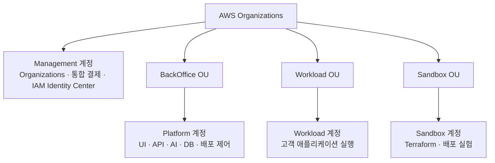

# AWS Organizations

최종 발표는 조직 관리, 플랫폼 운영, 고객 앱 실행, 실험을 계정별로 분리하는 구성을 설명합니다. 아래 조직도와 OU 이름은 **최종 발표의 AWS Organizations 절**을 기준으로 정리했습니다.

| 계정·OU | 역할 | 근거 범위 |
|---|---|---|
| Management | AWS Organizations, 통합 결제(Consolidated Billing), IAM Identity Center 관리 | 최종 발표의 설명 |
| BackOffice OU / Platform | PieckPick 화면·API·AI·DB와 배포 제어 운영 | OU 소속은 최종 발표, 플랫폼 자원 구성은 `platform-terraform/env/dev`와 Backend 코드 |
| Workload OU / Workload | 고객 애플리케이션이 실행되는 AWS 환경 | OU 소속은 최종 발표, 기반 환경·앱 템플릿은 `workload-terraform`·`workload-deploy` |
| Sandbox OU / Sandbox | Terraform과 배포 방식을 검증하는 실험 환경 | OU 소속·역할은 최종 발표, 별도 Sandbox 대상 선택은 배포 워크플로 코드 |

플랫폼 운영 자원과 고객 앱 실행 자원의 책임을 나누고, 환경별 변경·장애의 영향 범위를 줄이는 것이 계정 분리의 목적입니다. 최종 발표는 OU별 서비스 제어 정책(Service Control Policy, SCP)으로 환경에 맞는 권한 상한을 제한하는 설계도 설명합니다.

## 코드에서 확인한 경계

1. [platform-terraform의 dev 구성](https://github.com/softbank-hackathon-2026/platform-terraform/blob/b46bc8ba0031778eefff0c65eed3424a36d24676/env/dev/main.tf)은 플랫폼 네트워크, 프론트 S3, 내부 ALB, ECS Cluster, PostgreSQL RDS 등의 기반을 선언합니다.
2. [workload-terraform](https://github.com/softbank-hackathon-2026/workload-terraform/tree/3c828c5aa6a5c8fb82fbd4724dc50304e6d0ba6e)은 고객 실행용 Public·Multi-AZ·DB Isolated 기반 환경을 나눕니다.
3. [workload-deploy의 AWS 배포 워크플로](https://github.com/softbank-hackathon-2026/workload-deploy/blob/4852093f2f7e76a8014bef96d0acbc0c7384b39f/.github/workflows/deploy.yml)은 구성안의 대상 계정에 따라 Workload·Sandbox 자격 증명을 선택하고, 실제 대상 계정이 기대값과 일치하는지 검사합니다.
4. [Backend의 계정별 AWS client](https://github.com/softbank-hackathon-2026/Freesia-backend/blob/880e7da78f2fcb9100f3bfc354eceaa990c476b1/app/aws.py)는 환경별 AWS 조회를 분리합니다. 이것이 Organizations의 실제 OU 소속이나 SCP 적용을 증명하는 것은 아닙니다.

## 확인 범위

확인한 Terraform 진입점에서는 Organizations 조직, OU, IAM Identity Center 설정과 SCP를 생성·적용하는 선언을 확인하지 않았습니다. 따라서 조직 서비스와 OU·SCP의 실제 적용 상태는 발표의 설명과 구분합니다. 계정 ID, 자격 증명과 내부 접속 주소는 이 문서에 싣지 않습니다.

2026-10-05 확인 시점의 저장소 `main`을 다음 커밋으로 고정했습니다: [platform-terraform `b46bc8b`](https://github.com/softbank-hackathon-2026/platform-terraform/tree/b46bc8ba0031778eefff0c65eed3424a36d24676), [workload-terraform `3c828c5`](https://github.com/softbank-hackathon-2026/workload-terraform/tree/3c828c5aa6a5c8fb82fbd4724dc50304e6d0ba6e), [workload-deploy `4852093`](https://github.com/softbank-hackathon-2026/workload-deploy/tree/4852093f2f7e76a8014bef96d0acbc0c7384b39f), [backend `880e7da`](https://github.com/softbank-hackathon-2026/Freesia-backend/tree/880e7da78f2fcb9100f3bfc354eceaa990c476b1).

## Uncertainty Map

실제 Organizations 계정 목록·OU 소속·SCP 연결·Identity Center 구성은 이번 작업에서 실측하지 않았습니다. 조직도는 최종 발표에 제시된 구조를 전달하며, 코드 근거는 플랫폼과 고객 실행 환경의 역할 분리까지 확인합니다.

[인프라 아키텍처](infrastructure.md) · [README로 돌아가기](../profile/README.md)
