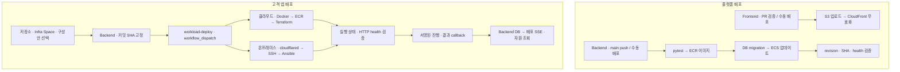

# CI/CD · 플랫폼과 고객 앱의 배포

[← 프로젝트 소개](../profile/README.md)

PieckPick 자체를 업데이트하는 플랫폼 배포와, 개발자가 선택한 저장소를 실행하는 고객 앱 배포는 별도 파이프라인입니다. 고객 앱은 Backend가 `workflow_dispatch`로 [workload-deploy](https://github.com/softbank-hackathon-2026/workload-deploy)를 실행하고, GitHub Actions가 실제 배포를 맡습니다.

## 플랫폼 배포

| 대상 | 트리거 | 검증과 배포 |
|---|---|---|
| Frontend CI | Pull request | Node.js 24, `npm ci`, `npm run check` |
| Frontend 배포 | 수동 `workflow_dispatch` | 검증 → 해시가 붙은 정적 파일 → `index.html` → CloudFront 무효화 완료 대기 → 배포된 HTML과 빌드 결과 비교 |
| Backend CI | main 대상 PR·main push | `pytest`, PostgreSQL 17에서 Alembic upgrade·downgrade·upgrade, Docker 이미지 빌드 |
| Backend 배포 | main push·수동 실행 | `pytest` → ECR → digest로 고정한 Task Definition → 일회성 DB migration → ECS 서비스 갱신 → 공개 API 검증 |

Backend는 migration이 성공한 뒤 서비스를 갱신합니다. ECS 안정화 뒤에도 새 Task Definition 적용 여부, `/api/version.txt`의 커밋 SHA, API·DB health를 확인해 이전 revision으로 롤백된 상태를 성공으로 처리하지 않습니다. [Frontend CI](https://github.com/softbank-hackathon-2026/Freesia-Frontend/blob/28cd1d78ff56da033231768ad06405bc23dfbbfd/.github/workflows/ci.yml), [Frontend 배포](https://github.com/softbank-hackathon-2026/Freesia-Frontend/blob/28cd1d78ff56da033231768ad06405bc23dfbbfd/.github/workflows/deploy.yml), [Backend CI](https://github.com/softbank-hackathon-2026/Freesia-backend/blob/880e7da78f2fcb9100f3bfc354eceaa990c476b1/.github/workflows/ci.yml), [Backend 배포](https://github.com/softbank-hackathon-2026/Freesia-backend/blob/880e7da78f2fcb9100f3bfc354eceaa990c476b1/.github/workflows/deploy.yml).

## 고객 앱 배포

1. **실행할 코드 확정:** 최초 배포는 분석한 커밋 SHA를 우선 사용합니다. 재배포는 사용자가 검토한 대상 SHA와 마지막 실제 성공 배포의 구성안을 확인합니다.
2. **빌드와 배포 분리:** 클라우드 고객 코드의 Docker build는 AWS 자격증명과 배포 secret이 없는 별도 job에서 실행합니다. 만들어진 이미지는 배포 job에서 ECR에 올리고 digest로 고정합니다.
3. **구성안 전달:** 워크플로는 서명된 요청으로 Backend의 `plan_id`를 읽고, 기존 Terraform 템플릿에 `values`와 Infra Space의 네트워크 값을 연결합니다. 대상 계정·템플릿·필수 인프라 값을 검사하고 앱 ID·이미지 같은 파이프라인 값의 덮어쓰기를 막습니다.
4. **배포와 검증:** 클라우드는 Terraform plan·apply와 자원별 이벤트를 사용합니다. ECS는 현재 Task Definition과 health 경로의 HTTP 응답을 확인합니다. 온프레미스는 고정 커밋의 소스를 VM에 전달하고, cloudflared를 통한 SSH와 Ansible로 소스 또는 컨테이너를 실행한 뒤 VM의 health 경로를 확인합니다.
5. **진행 표시:** `queued → prepare → build → deploy → verify → done` 단계와 자원 상태를 callback으로 DB에 기록합니다. 브라우저는 배포 이벤트를 SSE로 받고 자원 트리를 조회합니다.

클라우드 템플릿은 `ecs-fargate/basic`, `ecs-fargate/shared-alb`, `lambda/basic`, `ec2/basic`이며, 온프레미스는 `onprem`·`onprem-container`에 맞는 Ansible 플레이북을 선택합니다. AI의 역할은 [컴퓨팅과 설정값 추천](ai-recommendation.md)입니다. Terraform 코드와 Ansible 플레이북은 저장소에 준비된 것을 사용합니다. [Backend dispatch](https://github.com/softbank-hackathon-2026/Freesia-backend/blob/880e7da78f2fcb9100f3bfc354eceaa990c476b1/app/routers/app_spaces.py#L371), [클라우드 workflow](https://github.com/softbank-hackathon-2026/workload-deploy/blob/4852093f2f7e76a8014bef96d0acbc0c7384b39f/.github/workflows/deploy.yml), [VM workflow](https://github.com/softbank-hackathon-2026/workload-deploy/blob/4852093f2f7e76a8014bef96d0acbc0c7384b39f/.github/workflows/deploy-vm.yml), [구성값 처리](https://github.com/softbank-hackathon-2026/workload-deploy/blob/4852093f2f7e76a8014bef96d0acbc0c7384b39f/scripts/plan.py).

## 상태 보고와 실행 권한

Callback URL은 해당 배포의 고정된 플랫폼 경로와 일치해야 합니다. 요청 본문은 `HMAC-SHA256`으로 서명하고, Backend는 서명을 검증한 뒤 이미 끝난 배포와 이전 단계로 돌아가는 보고를 거절합니다. 고객 앱별 workflow 실행도 직렬화합니다. [서명 검증](https://github.com/softbank-hackathon-2026/Freesia-backend/blob/880e7da78f2fcb9100f3bfc354eceaa990c476b1/app/signing.py), [callback 수신](https://github.com/softbank-hackathon-2026/Freesia-backend/blob/880e7da78f2fcb9100f3bfc354eceaa990c476b1/app/routers/deployments.py#L124), [callback 송신](https://github.com/softbank-hackathon-2026/workload-deploy/blob/4852093f2f7e76a8014bef96d0acbc0c7384b39f/scripts/callback.py#L188).

AWS 자원 생성은 배포 워크플로의 계정별 자격증명으로 수행합니다. Backend의 Bedrock 호출용 ECS 작업 역할(Task Role), 고객 계정의 인프라·CloudWatch 읽기 키, 배포 자격증명은 용도가 다릅니다. [Backend AWS client](https://github.com/softbank-hackathon-2026/Freesia-backend/blob/880e7da78f2fcb9100f3bfc354eceaa990c476b1/app/aws.py).

## 확인 범위

`DEPLOY_SIMULATE=true`이면 실제 workflow 대신 샘플 진행을 기록합니다. Callback 전송 실패도 배포 workflow를 실패시키지는 않으므로, 화면 상태와 실제 실행 결과는 함께 확인해야 합니다. 이 문서는 고정한 소스의 동작을 설명하며 현재 AWS 운영 상태나 특정 배포 성공을 보증하지 않습니다.

Workload CI는 Terraform format·validate·mock-provider test와 Actions runner에서의 Ansible 배포·제거 검증을 수행합니다. 이는 실계정·실제 VM 배포와 별도 검증입니다. [검증 workflow](https://github.com/softbank-hackathon-2026/workload-deploy/blob/4852093f2f7e76a8014bef96d0acbc0c7384b39f/.github/workflows/validate.yml), [실행 모드 설정](https://github.com/softbank-hackathon-2026/Freesia-backend/blob/880e7da78f2fcb9100f3bfc354eceaa990c476b1/app/config.py#L25).
