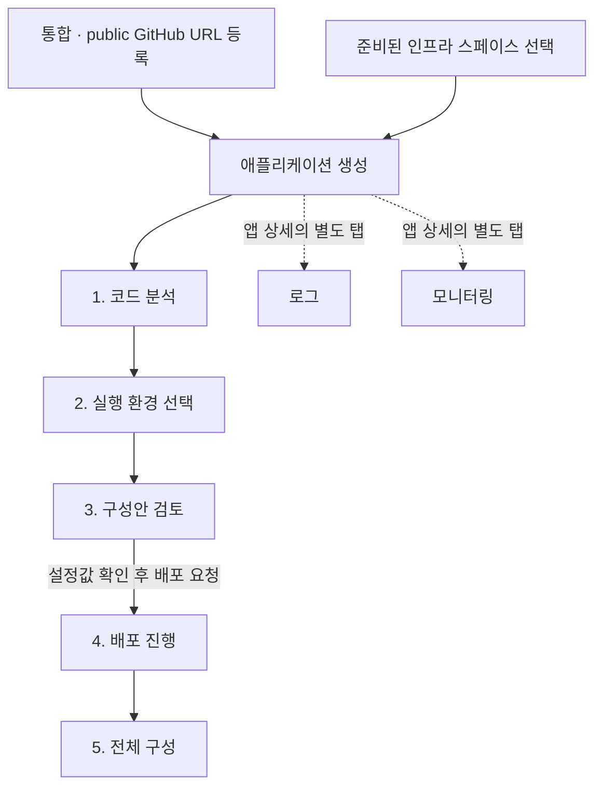
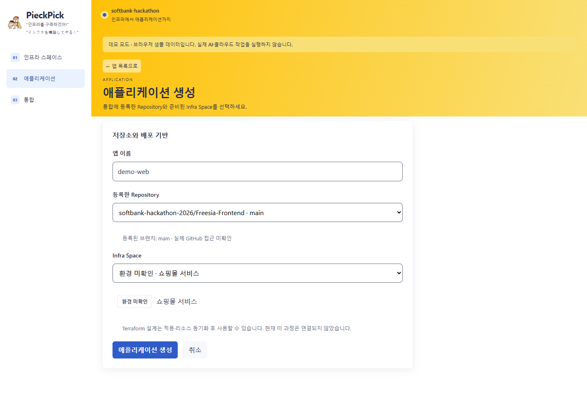
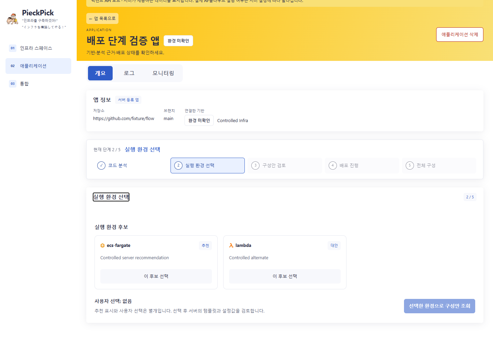
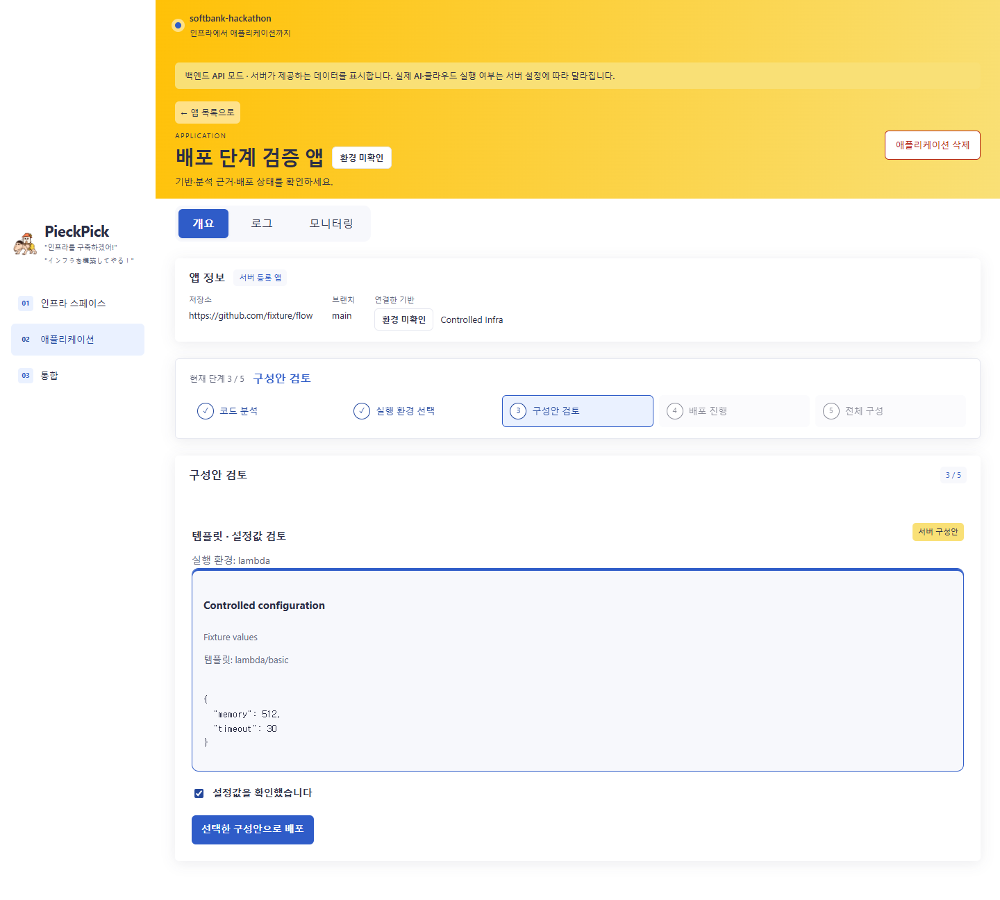
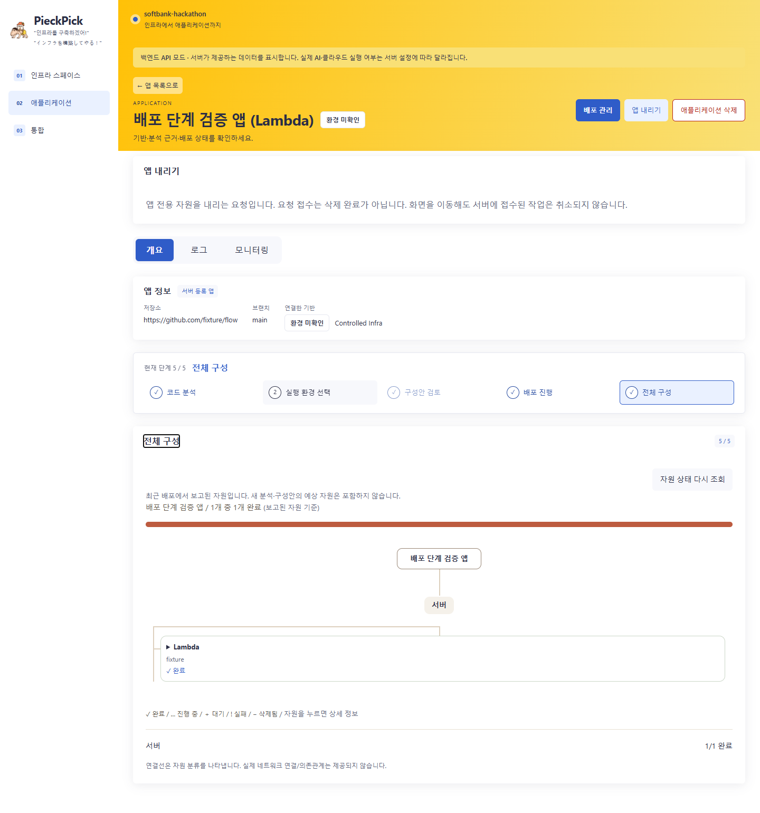

# 프런트엔드 화면 흐름

[← PieckPick 프로젝트 소개](../profile/README.md)

PieckPick은 공개 GitHub 저장소와 준비된 인프라 스페이스(Infra Space)를 애플리케이션(App Space)으로 연결하고, 분석부터 배포와 운영 상태 확인까지 같은 콘솔에서 진행합니다. 기본 화면은 백엔드 API 모드이며, 앱 상세의 `개요`에는 배포 5단계, `로그`와 `모니터링`에는 각각의 운영 데이터가 표시됩니다.

설명은 [Freesia-Frontend의 고정 커밋 `28cd1d7`](https://github.com/softbank-hackathon-2026/Freesia-Frontend/tree/28cd1d78ff56da033231768ad06405bc23dfbbfd)을 기준으로 합니다. 아래 캡처는 2026-10-04에 현재 구현을 브라우저에서 검증하며 저장한 화면입니다. 앱 생성 캡처는 브라우저 데모 데이터, 나머지 캡처는 테스트 API 응답(fixture)을 사용합니다. 캡처의 진행률·완료 표시는 검증용 상태 예시입니다.

## 1. 저장소와 배포 기반 연결

1. **통합 → Repository 등록:** 기존 public GitHub 저장소 URL을 등록합니다. 새 등록은 `main` 브랜치를 사용합니다. 이 단계는 서버에 주소를 저장하며, 저장소의 존재·공개 여부·브랜치 접근 권한은 검증하지 않습니다.
2. **인프라 스페이스 확인:** 준비된 기반의 네트워크 특성, 연결된 앱 수와 환경을 확인합니다. 실제 배포 가능 여부는 서버가 제공하는 기반과 실행 환경 지원 상태에 따라 결정됩니다.
3. **애플리케이션 생성:** 앱 이름, 등록한 Repository, Infra Space를 선택합니다. API 모드에는 `샌드박스 배포` 옵션도 있습니다. 등록한 저장소가 없으면 통합 화면으로 안내합니다.

*현재 앱 생성 폼의 브라우저 데모 캡처. 실제 API 모드도 저장소와 배포 기반을 연결하며, 별도로 샌드박스 옵션을 제공합니다.*

## 2. 앱 상세의 배포 5단계

| 단계 | 사용자가 확인하거나 실행하는 내용 |
| --- | --- |
| **1 · 코드 분석** | `코드 분석 시작`으로 서버 분석을 요청합니다. 확인된 요구사항, 파일별 근거, 불확실성과 실행 환경 후보를 읽습니다. 분석 대기 중에는 상태를 다시 조회합니다. |
| **2 · 실행 환경 선택** | 추천·대안과 기반 지원 여부를 확인하고 `이 후보 선택`을 누릅니다. 추천 표시와 사용자 선택은 구분됩니다. `선택한 환경으로 구성안 조회`로 넘어갑니다. |
| **3 · 구성안 검토** | 서버가 반환한 구성안, 템플릿과 설정값(values)을 확인합니다. `설정값을 확인했습니다`를 체크한 뒤 `선택한 구성안으로 배포`를 요청합니다. |
| **4 · 배포 진행** | `대기 → 배포 준비 → 빌드 → 배포 → 정상 응답 확인 → 완료`의 상태, 진행률, 경과 시간과 배포 상세를 확인합니다. 배포 이벤트는 Server-Sent Events(SSE)로 구독합니다. |
| **5 · 전체 구성** | 최근 배포에서 보고된 자원 또는 온프레미스 Ansible 작업을 트리로 확인합니다. 완료·진행 중·대기·실패·삭제됨을 구분하고 항목을 눌러 상세를 봅니다. |

### 실행 환경 선택

분석 추천과 배포 준비 상태를 함께 보여줍니다. 기반에서 지원하지 않거나 분석에서 부적합으로 판단된 후보는 선택할 수 없습니다. 추천이 있어도 서버가 배포 가능한 상태를 제공해야 다음 요청을 진행할 수 있습니다.

*테스트 API가 제공한 ECS Fargate 추천과 Lambda 대안을 실제 컴포넌트로 표시한 검증 화면.*

### 구성안 검토

사용자는 실행 환경과 템플릿, 설정값을 검토하고 배포 요청을 명시적으로 보냅니다. 앱을 열거나 분석을 완료한 것만으로 배포가 시작되지는 않습니다.

*테스트 API 구성안으로 검증한 화면. 캡처의 Lambda 설정값은 예시이며 실제 앱에는 서버가 반환한 설정을 사용합니다.*

### 배포 진행과 전체 구성

4단계는 진행 상태, 5단계는 전체 구성 트리를 각각 담당합니다. 성공 상태를 받으면 5단계로 이동하며, 실패 상태는 4단계에서 이유를 확인하고 명시적으로 다시 시도합니다. 서버가 보고한 유효한 앱 URL이 있으면 해당 주소로 이동할 수 있습니다.

*테스트 API가 보고한 자원으로 검증한 5단계 화면. 트리의 연결선은 자원 분류를 나타냅니다. 실제 네트워크 연결이나 의존 관계를 뜻하지 않습니다.*

구성 트리에는 최근 배포에서 보고된 항목만 표시합니다. 새 분석이나 검토 중인 구성안의 예상 자원은 포함하지 않습니다. 온프레미스에서는 `Ansible 작업 현황`으로 표시하며, 수신된 작업의 완료 수와 전체 배포 진행률을 구분합니다.

## 3. 로그와 모니터링

`로그`와 `모니터링`은 앱 상세의 별도 탭입니다. 5단계 구성 트리에 운영 패널을 중복으로 넣지 않습니다.

| 탭 | 화면 동작 |
| --- | --- |
| **로그** | 애플리케이션 로그를 표시합니다. API 모드에서는 탭이 활성화된 동안 약 15초마다 다시 조회하며, 수동 새로고침과 자동 갱신 일시정지·재개를 제공합니다. |
| **모니터링** | 실행 환경에 맞는 지표 값과 측정 시각을 표시합니다. 약 15초마다 다시 조회합니다. 수신된 숫자 `0`은 그대로 표시하고, 측정값이 없으면 `—`와 `측정값 없음`으로 구분합니다. |

두 탭 모두 `수신`, `수집 대기`, `미배포`, `지원 안 됨`, `수집 오류`를 구분합니다. 화면을 보려면 [모니터링 구조](monitoring.md), 배포 실행 경로는 [CI/CD](cicd.md)를 함께 참고하세요.

## 4. 다시 열기와 운영 작업

| 작업 | 동작 |
| --- | --- |
| **앱 다시 열기** | 앱과 최신 배포를 서버에서 다시 조회합니다. 성공 배포는 전체 구성, 진행 중·실패 배포는 배포 진행을 복원합니다. 진행 중인 배포는 이벤트 구독을 이어갑니다. |
| **배포 관리 → 새 버전 재배포** | 이전 성공 배포의 템플릿·설정값과 대상 커밋 SHA를 조회합니다. 사용자가 대상 버전과 설정을 확인한 뒤 요청합니다. 재사용 가능한 성공 구성이 없으면 설정 변경·재분석으로 안내합니다. |
| **배포 관리 → 설정 변경 · 재분석** | 코드를 다시 분석하고 실행 환경·구성안을 새로 선택합니다. 기존 성공 설정을 유지하는 재배포와 구분됩니다. |
| **앱 내리기** | 앱 전용 자원을 내리는 작업을 요청하고 서버 상태를 추적합니다. 요청 접수와 삭제 완료를 구분하며, 화면을 이동해도 접수된 서버 작업은 취소되지 않습니다. |
| **애플리케이션 삭제** | API 모드에서는 앱을 목록에서 숨깁니다. 배포·분석 기록과 연결된 인프라·Repository는 유지합니다. 배포된 앱은 내리기를 완료해야 하며, 배포·내리기 중에는 삭제할 수 없습니다. |

## 5. AI 인프라 생성의 현재 범위

애플리케이션의 서버 분석·배포 흐름과 인프라 스페이스 생성 데모를 구분합니다.

- **API 모드:** 서버가 제공하는 인프라 정보를 조회합니다. 현재 프런트엔드의 `Infra Space 만들기`, 요구사항 대화, Terraform 생성·검토와 Apply 이력은 API 연동 대기로 표시합니다.
- **브라우저 데모:** 이름 입력 → 요구사항 대화 → Terraform 생성·검토 → `Apply 시작 · 데모`를 로컬 샘플 상태로 진행합니다. 실제 AI 호출이나 AWS 자원 생성은 실행하지 않습니다.
- **연결된 앱 배포:** 준비된 인프라와 등록한 저장소를 사용하는 별도의 서버 API 흐름입니다. 실제 AI·클라우드 실행 여부와 지원 환경은 백엔드 설정과 상태에 따라 결정됩니다.

## 구현 근거

링크는 모두 같은 고정 커밋을 가리킵니다.

- [앱 생성·5단계·복원·재배포·내리기·삭제](https://github.com/softbank-hackathon-2026/Freesia-Frontend/blob/28cd1d78ff56da033231768ad06405bc23dfbbfd/src/components/Applications.tsx), [SSE와 API 요청](https://github.com/softbank-hackathon-2026/Freesia-Frontend/blob/28cd1d78ff56da033231768ad06405bc23dfbbfd/src/lib/api.ts)
- [저장소 등록](https://github.com/softbank-hackathon-2026/Freesia-Frontend/blob/28cd1d78ff56da033231768ad06405bc23dfbbfd/src/components/GitHubIntegration.tsx), [인프라 생성 폼](https://github.com/softbank-hackathon-2026/Freesia-Frontend/blob/28cd1d78ff56da033231768ad06405bc23dfbbfd/src/components/InfraSpaceForm.tsx), [API 조회·데모 생성 경계](https://github.com/softbank-hackathon-2026/Freesia-Frontend/blob/28cd1d78ff56da033231768ad06405bc23dfbbfd/src/components/InfraBuilder.tsx)
- [전체 구성 트리](https://github.com/softbank-hackathon-2026/Freesia-Frontend/blob/28cd1d78ff56da033231768ad06405bc23dfbbfd/src/components/DeploymentResources.tsx)
- [로그 탭](https://github.com/softbank-hackathon-2026/Freesia-Frontend/blob/28cd1d78ff56da033231768ad06405bc23dfbbfd/src/components/ApplicationLogs.tsx), [모니터링 탭](https://github.com/softbank-hackathon-2026/Freesia-Frontend/blob/28cd1d78ff56da033231768ad06405bc23dfbbfd/src/components/ApplicationMetrics.tsx)
- [화면 흐름·API fixture 캡처 검증](https://github.com/softbank-hackathon-2026/Freesia-Frontend/blob/28cd1d78ff56da033231768ad06405bc23dfbbfd/scripts/deployment-flow-check.mjs), [앱 생성 캡처 검증](https://github.com/softbank-hackathon-2026/Freesia-Frontend/blob/28cd1d78ff56da033231768ad06405bc23dfbbfd/scripts/browser-check.mjs)
