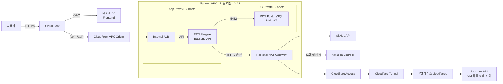
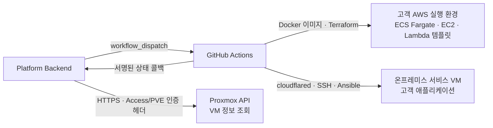

# 인프라 아키텍처

PieckPick 플랫폼은 화면·API·DB와 배포 제어를 운영합니다. 고객 애플리케이션은 별도의 AWS 실행 환경 또는 온프레미스 VM에 배포합니다. 아래 그림은 **저장소에 선언된 구성과 호출 관계**이며, 실제 클라우드의 현재 상태를 조회한 결과는 아닙니다.

## 플랫폼 진입 경로

실선은 코드의 선언·호출 관계이고, 점선은 최종 발표에서 설명한 외부 터널 구성입니다. S3는 VPC 내부 서브넷에 배치한 자원이 아니라 CloudFront가 OAC로 읽는 별도 서비스입니다.

| 구성 | 코드에서 확인한 동작 |
|---|---|
| CloudFront · S3 | 프론트엔드는 S3 public access를 차단하고, 지정 CloudFront 배포의 OAC 접근을 허용합니다. 확장자 없는 SPA 경로는 CloudFront Function으로 처리합니다. |
| API 진입 | `/api`, `/api/*`를 VPC Origin으로 전달합니다. ALB는 `internal = true`이며 API 대상 그룹과 연결합니다. |
| Private 네트워크 | 두 AZ에 App·DB private subnet을 각각 둡니다. 플랫폼용 public subnet은 선언하지 않으며, App 송신은 Regional NAT를 사용하고 DB subnet에는 NAT 기본 경로를 만들지 않습니다. |
| DB | PostgreSQL RDS는 `publicly_accessible = false`, Multi-AZ, 저장소 암호화, 백업과 삭제 보호를 사용하도록 선언돼 있습니다. |
| 배포 소유권 | Terraform은 ECS Cluster·로그 그룹·네트워크·접근 기반을 준비합니다. 플랫폼 API의 Task Definition과 Service 생성·갱신은 Backend CI/CD가 담당합니다. |

근거: [플랫폼 구성](https://github.com/softbank-hackathon-2026/platform-terraform/blob/b46bc8ba0031778eefff0c65eed3424a36d24676/env/dev/main.tf), [CloudFront 경로](https://github.com/softbank-hackathon-2026/platform-terraform/blob/b46bc8ba0031778eefff0c65eed3424a36d24676/modules/cloudfront/main.tf), [보안 그룹 연결](https://github.com/softbank-hackathon-2026/platform-terraform/blob/b46bc8ba0031778eefff0c65eed3424a36d24676/env/dev/security.tf), [Terraform·CI/CD 경계](https://github.com/softbank-hackathon-2026/platform-terraform/blob/b46bc8ba0031778eefff0c65eed3424a36d24676/env/dev/README.md#L3-L30).

## 플랫폼 제어와 고객 앱 실행

백엔드의 Proxmox 조회와 GitHub Actions의 VM 앱 배포는 서로 다른 작업입니다. 백엔드는 Cloudflare Access·Proxmox 인증 헤더로 VM 정보를 읽고, 온프레미스 배포 워크플로는 cloudflared·SSH·Ansible Runner를 사용합니다. 외부 터널과 실제 VM 접속 설정은 별도로 준비돼 있어야 합니다.

AWS용 기반 환경은 [workload-terraform](https://github.com/softbank-hackathon-2026/workload-terraform/tree/3c828c5aa6a5c8fb82fbd4724dc50304e6d0ba6e)이 관리하며, 앱별 실행 자원은 [workload-deploy의 템플릿](https://github.com/softbank-hackathon-2026/workload-deploy/tree/4852093f2f7e76a8014bef96d0acbc0c7384b39f/templates)이 구성합니다.

| 고객 환경 | 저장소의 현재 구성 |
|---|---|
| Public | 두 AZ의 public subnet을 준비합니다. Fargate `basic` 템플릿은 앱별 internet-facing ALB와 public IP가 있는 task를 사용합니다. |
| Multi-AZ | public·private·DB subnet과 공유 HTTPS ALB를 준비합니다. `shared-alb` 템플릿은 private Fargate와 외부 송신 경로를 전제로 합니다. 현재 기반 코드의 NAT 기본값은 `none`이므로, 이미지 pull 경로가 준비됐는지는 별도 확인이 필요합니다. |
| DB Isolated | public subnet, 인터넷 기본 경로가 없는 DB subnet, Session Manager용 bastion과 S3 Gateway Endpoint를 선언합니다. 이 기반 파일 자체가 고객용 DB 인스턴스를 생성하는 것은 아닙니다. |
| EC2 · Lambda | EC2의 Docker 실행과 Lambda 컨테이너·Function URL 템플릿이 존재합니다. 템플릿 존재와 실제 배포 성공은 구분합니다. |
| 온프레미스 VM | GitHub Actions가 Ansible Runner로 앱을 설치하고 단계별 상태를 보고합니다. 워크플로 주석에는 SSH 연결 구성이 온프레미스 담당자 확인 전 가정이라고 명시돼 있습니다. |

근거: [Public 기반](https://github.com/softbank-hackathon-2026/workload-terraform/blob/3c828c5aa6a5c8fb82fbd4724dc50304e6d0ba6e/public-env/main.tf), [Multi-AZ 기반](https://github.com/softbank-hackathon-2026/workload-terraform/blob/3c828c5aa6a5c8fb82fbd4724dc50304e6d0ba6e/multiaz-env/main.tf), [DB 격리 기반](https://github.com/softbank-hackathon-2026/workload-terraform/blob/3c828c5aa6a5c8fb82fbd4724dc50304e6d0ba6e/dbisolated-env/main.tf), [Fargate basic](https://github.com/softbank-hackathon-2026/workload-deploy/blob/4852093f2f7e76a8014bef96d0acbc0c7384b39f/templates/ecs-fargate/basic/main.tf), [Fargate shared-alb](https://github.com/softbank-hackathon-2026/workload-deploy/blob/4852093f2f7e76a8014bef96d0acbc0c7384b39f/templates/ecs-fargate/shared-alb/main.tf), [VM 배포](https://github.com/softbank-hackathon-2026/workload-deploy/blob/4852093f2f7e76a8014bef96d0acbc0c7384b39f/.github/workflows/deploy-vm.yml#L184-L210).

## 사용 기술과 확인 범위

| 영역 | 확인된 서비스·도구 |
|---|---|
| 진입·네트워크 | CloudFront, S3, ALB, VPC·Security Group, Regional NAT Gateway·Internet Gateway, ACM |
| 실행·데이터 | ECS Fargate, ECR, RDS PostgreSQL, 고객용 EC2·Lambda 템플릿 |
| 접근·운영 | IAM, Systems Manager Parameter Store·Session Manager, Secrets Manager, CloudWatch Logs·메트릭 조회 |
| AI·자동화·연결 | Amazon Bedrock, Terraform, GitHub Actions, Docker, Cloudflare Tunnel·Access, Proxmox, Ansible |

Bedrock 호출은 모델 설정이 있는 경우에 실행됩니다. 모델 설정이 없으면 백엔드는 샘플 분석 결과를 저장합니다. 계정별 AWS 조회의 자격 증명과 플랫폼 task 실행 역할은 구분해야 합니다. 자세한 실행 흐름은 [CI/CD](cicd.md)를 참고하세요.

Route 53, EKS, Aurora를 현재 플랫폼의 실행 구성으로 표시하지 않습니다. 확인한 DNS 구성 주석은 Cloudflare 관리를 설명하며, 범용 모듈이 존재하는 것만으로 해당 서비스가 현재 환경에서 사용된다고 판단하지 않습니다. TGW 중심 연결 전환과 인프라 변경 시 AI 재분석은 최종 발표의 개선 계획입니다.

## 근거 버전

2026-10-05 확인 시점의 각 저장소 `main`을 아래 커밋으로 고정했습니다.

| 저장소 | 커밋 |
|---|---|
| platform-terraform | [`b46bc8b`](https://github.com/softbank-hackathon-2026/platform-terraform/tree/b46bc8ba0031778eefff0c65eed3424a36d24676) |
| workload-terraform | [`3c828c5`](https://github.com/softbank-hackathon-2026/workload-terraform/tree/3c828c5aa6a5c8fb82fbd4724dc50304e6d0ba6e) |
| workload-deploy | [`4852093`](https://github.com/softbank-hackathon-2026/workload-deploy/tree/4852093f2f7e76a8014bef96d0acbc0c7384b39f) |
| backend | [`880e7da`](https://github.com/softbank-hackathon-2026/Freesia-backend/tree/880e7da78f2fcb9100f3bfc354eceaa990c476b1) |

Backend 근거: [GitHub dispatch](https://github.com/softbank-hackathon-2026/Freesia-backend/blob/880e7da78f2fcb9100f3bfc354eceaa990c476b1/app/github.py), [Proxmox 조회](https://github.com/softbank-hackathon-2026/Freesia-backend/blob/880e7da78f2fcb9100f3bfc354eceaa990c476b1/app/onprem.py), [Bedrock 호출](https://github.com/softbank-hackathon-2026/Freesia-backend/blob/880e7da78f2fcb9100f3bfc354eceaa990c476b1/app/ai/analyze.py), [모델 미설정 분기](https://github.com/softbank-hackathon-2026/Freesia-backend/blob/880e7da78f2fcb9100f3bfc354eceaa990c476b1/app/analysis.py).

## Uncertainty Map

실제 계정의 자원 상태, 터널·VM 접속, 각 실행 템플릿의 배포 성공은 이번 문서 작업에서 실측하지 않았습니다. 코드 선언, 호출 구현, 최종 발표의 설명을 근거별로 구분했습니다.

[조직 구성](aws-organizations.md) · [README로 돌아가기](../profile/README.md)
